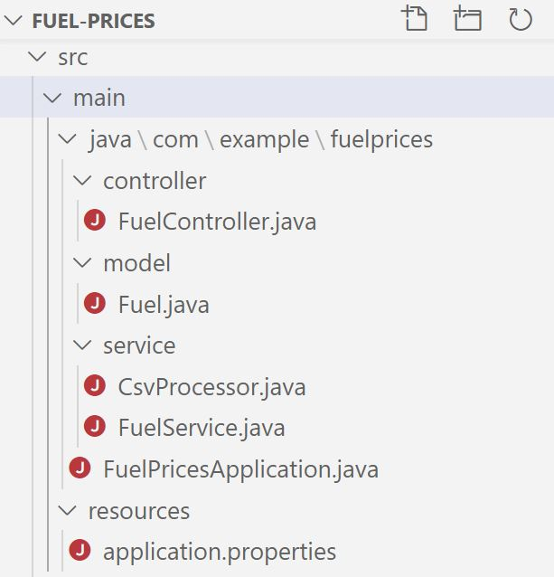

# Fuel Prices

This is a [Reactive](https://www.reactivemanifesto.org/), non-blocking, asynchronous implementation of an API consuming 
the CSV of [Weekly road fuel prices](https://www.gov.uk/government/statistical-data-sets/oil-and-petroleum-products-weekly-statistics) from
[Department for Business, Energy & Industrial Strategy](https://www.gov.uk/government/organisations/department-for-business-energy-and-industrial-strategy) using Spring Webflux.
Adhering to the Reactive paradigm should enable building systems that are more responsive, consume less resources and more elastic.


Table of contents
=================

<!--ts-->
   * [Endpoints](#endpoints)
     * [Responses](#responses)
       * [Success](#success)
   * [Requirements](#requirements)
   * [Project Structure](#project-structure)
   * [Features](#features)
     * [Configuration](#configuration)
     * [Resilience and performance](#resilience-and-performance)
   * [Running the application locally](#running-the-application-locally)         
<!--te-->

## Endpoints

| Endpoint                       | purpose                                  | Remarks
| ----------------------------- | ---------------------------------------- | ----------------------------------------
| http://localhost:8080/fuel   | Return a list of all weekly fuel prices  | JSON format
| http://localhost:8080/fuel/just/dd-MM-yyyy   | Return a list of all weekly fuel prices on the specified date  | JSON format
| http://localhost:8080/fuel/after/dd-MM-yyyy   | Return a list of all weekly fuel prices after the specified date  | JSON format
| http://localhost:8080/fuel/before/dd-MM-yyyy   | Return a list of all weekly fuel prices before the specified date  | JSON format

You can change the localhost port number in application.properties in resources directory.

### Responses

Using browser or postman, go to one of the endpoints, e.g.:

    http://localhost:8080/fuel
    
Using curl:

    curl --request GET http://localhost:8080/fuel

#### Success:

**URL** : `localhost:8080/fuel`

**Method** : `GET`

**Code** : `200 OK`

**Content** : Just for demonstration, the user will see similar response returned:

**Response Body:**
```json
[
  {
    "Date": "04/10/2010",
    "ULSP_Price": 116.01,
    "ULSD_Price": 118.97,
    "ULSP_Rate": 58.19,
    "ULSD_Rate": 58.19,
    "ULSP_VatRate": 17.5,
    "ULSD_VatRate": 17.5
  },
  {
    "Date": "11/10/2010",
    "ULSP_Price": 116.78,
    "ULSD_Price": 119.77,
    "ULSP_Rate": 58.19,
    "ULSD_Rate": 58.19,
    "ULSP_VatRate": 17.5,
    "ULSD_VatRate": 17.5
  }
]
```

**Response Headers**
```yaml
 connection: keep-alive  
 content-type: application/json  
 date: Day, Date Time GMT  
 keep-alive: timeout=60  
 transfer-encoding: chunked 
```
  

## Requirements
- Java 11
- Maven

## Project Structure

 <h2 align="left">
   
 </h2>
 
 
 **1- Controller**
 
 Contains one method to reply to a GET request for the required requests. Each method subscribes to a Flux of fuel prices from the service layer.  
 
 **2- model** 

Contains the Fuel prices model.

 **3- Service**
 Contains 2 components:
 
 1- CsvProcessor: streams the data from a CSV stored at spreadsheet/fuel_prices.csv and publishes a Flux of fuel prices.
 
 2- FuelService: Subscribes to the Flux of fuel prices from the CsvProcessor and does some business logic against the date.

## Features
#### Configuration
The application primarily is built to satisfy mock requirements to transfer the dat ain CSV to JSON format to be consumed by other services.
However, there are elements of reusability and configuration to change a number of things:

**1- Changing source of the data:** 
   By going to the application.properties and changing the value of: 
    
```properties
    file=spreadsheet\\fuel_prices.csv
```
You will be able to change the source of the CSV. This CSV could be stored on another location or another remote machine.

#### Resilience and performance: 

**1- Reactive Application**

This application developed using reactive, non-blocking, async programming model using Spring WebFlux as a reactive webframework. Spring WebFlux is based on a reactive HTTP layer and running on Netty.
This approach is more efficient for interconnected microservices. It is also beneficial for efficiency and scalability for systems which need to handle large numbers of concurrent requests. 

[More information about Reactive Stack](https://docs.spring.io/spring-framework/docs/current/spring-framework-reference/web-reactive.html)

More features could be added such as retry with back-off or circuit-breaker.


## Running the application locally
There are several ways to run a Spring Boot application on your local machine. 
One way is to execute the main method in the com.example.fuelprices.FuelPricesApplication class from your IDE.
- Download the zip or clone the Git repository via
```http request
    https://github.com/ASweilam/fuel-prices.git
```
- Unzip the zip file (if you downloaded one)

- For Eclipse: 
    
    Open Eclipse File -> Import -> Existing Maven Project -> Navigate to the folder where you unzipped the zip
    Select the project.
     
    Choose the Spring Boot Application file (FuelPricesApplication) or search for (@SpringBootApplication)
    Right Click on the file and Run as Java Application.
    
- For IntelliJ: 
        File -> New -> Project from Source Code -> Navigate to the folder where you unzipped the zip
        Select the project.                                             
        Choose the Spring Boot Application file (FuelPricesApplication) or search for (@SpringBootApplication)
        Right Click on the file and Run as Java Application.
        
- Alternatively you can use the Spring Boot Maven plugin like so:
```   
    mvn spring-boot:run     
```        
 
 The application configured via application.properties. This is where you can change some configurations such as
 changing the localhost port.
```properties    
    # Localhost port
    server.port=8080
 ```   